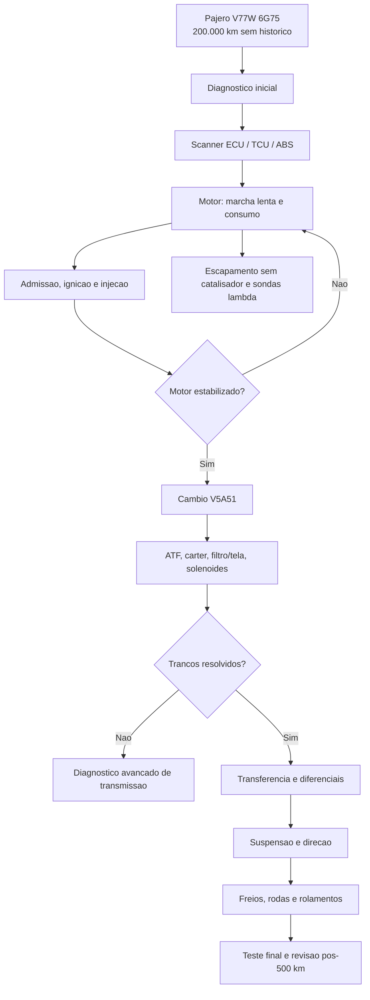

# Fluxograma Macro de Diagnostico

Imagem base fornecida pelo usuario:

## Mermaid

## Regra de leitura

Se o motor nao estiver estabilizado, nao concluir falha interna de cambio apenas pelo tranco. Marcha lenta irregular, mistura incorreta, coxins, folgas em cardas/diferenciais e ATF degradado podem se somar.
