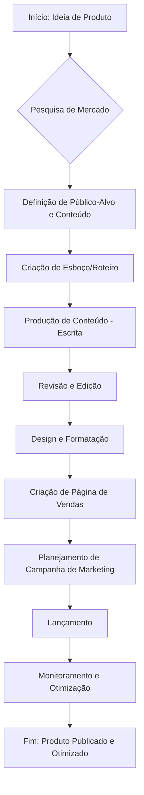
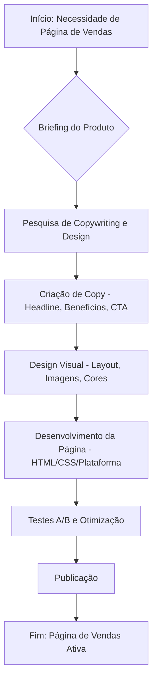
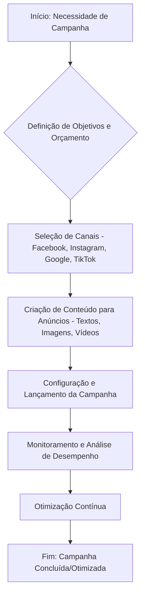
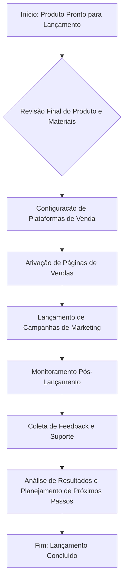
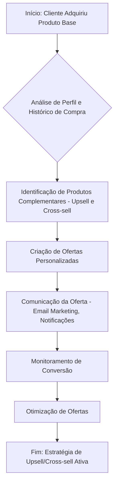
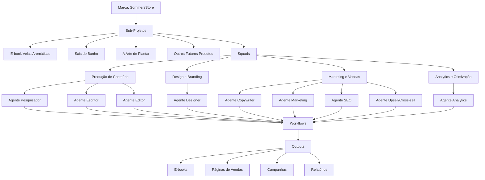

# Arquitetura do Projeto SommersStore

## 1. Recomendação de Arquitetura: Projeto Único vs. Projetos Separados

### Tabela Comparativa

| Característica / Abordagem | Projeto Único (Monorepo) | Projetos Separados (Multirepo) |
| :------------------------- | :----------------------- | :----------------------------- |
| **Gerenciamento**          | Centralizado             | Distribuído                    |
| **Reutilização de Código** | Alta                     | Baixa                          |
| **Consistência**           | Alta                     | Média                          |
| **Complexidade Inicial**   | Média/Alta               | Baixa                          |
| **Escalabilidade**         | Alta                     | Média/Alta                     |
| **Independência**          | Baixa                    | Alta                           |
| **Deploy**                 | Unificado/Modular        | Separado                       |
| **Ferramentas**            | Mais complexas           | Mais simples                   |

### Justificativa

Para o projeto SommersStore, a recomendação é adotar uma **arquitetura de projeto único (monorepo)**. Embora a criação de projetos separados possa parecer mais simples inicialmente para cada produto digital, a natureza guarda-chuva da marca SommersStore e a interconexão entre os produtos (e-books, páginas de vendas, campanhas) justificam a centralização.

Um monorepo permite uma **gestão mais eficiente de ativos compartilhados**, como templates de páginas de vendas, elementos de branding, diretrizes de copywriting e estratégias de marketing. Isso reduz a duplicação de esforços e garante uma **consistência visual e de mensagem** em todos os produtos e campanhas. Além disso, facilita a **reutilização de código e componentes**, o que é crucial para escalar a produção de novos e-books e campanhas de forma ágil.

Apesar de uma complexidade inicial ligeiramente maior na configuração e no gerenciamento de dependências, os benefícios a longo prazo em termos de **manutenção, colaboração e padronização** superam as desvantagens. A capacidade de ter uma visão holística de todos os sub-projetos sob a mesma estrutura simplifica o planejamento estratégico e a execução de lançamentos completos, que envolvem múltiplos componentes (produto, página de vendas, campanhas).

## 2. Estrutura de Pastas Completa

A seguir, apresenta-se uma estrutura de diretórios detalhada e escalável para o projeto SommersStore, projetada para acomodar todos os produtos digitais, campanhas e ativos de forma organizada:

```
sommersstore/
├── .git/
├── docs/
│   ├── arquitetura_sommersstore.md
│   └── README.md
├── assets/
│   ├── images/
│   │   ├── logos/
│   │   ├── icons/
│   │   ├── product_covers/
│   │   └── general/
│   ├── videos/
│   ├── audio/
│   └── fonts/
├── templates/
│   ├── ebook_templates/
│   │   ├── default.md
│   │   └── custom_niche.md
│   ├── sales_page_templates/
│   │   ├── default_lp.html
│   │   └── high_conversion_lp.html
│   ├── email_templates/
│   └── ad_copy_templates/
├── products/
│   ├── velas_aromaticas_ebook/
│   │   ├── src/
│   │   │   ├── content.md
│   │   │   └── images/
│   │   ├── output/
│   │   │   ├── ebook_final.pdf
│   │   │   └── ebook_final.epub
│   │   └── marketing/
│   │       ├── sales_page/
│   │       │   ├── index.html
│   │       │   └── assets/
│   │       └── campaigns/
│   │           ├── facebook_ads/
│   │           │   ├── ad_copy.md
│   │           │   └── creatives/
│   │           └── google_ads/
│   ├── sais_de_banho_ebook/
│   │   ├── src/
│   │   │   ├── content.md
│   │   │   └── images/
│   │   ├── output/
│   │   │   ├── ebook_final.pdf
│   │   │   └── ebook_final.epub
│   │   └── marketing/
│   │       ├── sales_page/
│   │       │   ├── index.html
│   │       │   └── assets/
│   │       └── campaigns/
│   │           ├── instagram_ads/
│   │           │   ├── ad_copy.md
│   │           │   └── creatives/
│   │           └── tiktok_ads/
│   ├── a_arte_de_plantar_ebook/
│   │   ├── src/
│   │   │   ├── content.md
│   │   │   └── images/
│   │   ├── output/
│   │   │   ├── ebook_final.pdf
│   │   │   └── ebook_final.epub
│   │   └── marketing/
│   │       ├── sales_page/
│   │       │   ├── index.html
│   │       │   └── assets/
│   │       └── campaigns/
│   │           ├── email_marketing/
│   │           │   ├── subject_lines.md
│   │           │   └── body_copy.md
│   │           └── blog_posts/
│   └── future_product_name/
│       ├── src/
│       ├── output/
│       └── marketing/
├── marketing_global/
│   ├── social_media/
│   │   ├── facebook/
│   │   ├── instagram/
│   │   ├── tiktok/
│   │   └── google/
│   ├── email_marketing/
│   ├── blog/
│   └── seo/
├── analytics/
│   ├── reports/
│   │   ├── sales_performance.csv
│   │   └── campaign_results.csv
│   ├── dashboards/
│   └── raw_data/
├── scripts/
│   ├── automation/
│   └── data_processing/
└── README.md
```

**Explicação da Estrutura:**

*   **`sommersstore/`**: Diretório raiz do projeto monorepo.
*   **`.git/`**: Controle de versão (Git).
*   **`docs/`**: Documentação geral do projeto, incluindo esta arquitetura.
*   **`assets/`**: Ativos compartilhados entre todos os produtos e campanhas (imagens, vídeos, áudios, fontes).
*   **`templates/`**: Modelos reutilizáveis para e-books, páginas de vendas, e-mails e anúncios, garantindo consistência e agilidade.
*   **`products/`**: Contém subdiretórios para cada produto digital individual. Cada sub-projeto tem sua própria estrutura interna:
    *   **`src/`**: Conteúdo bruto do e-book (Markdown, imagens específicas do produto).
    *   **`output/`**: Versões finais do e-book em diferentes formatos (PDF, EPUB).
    *   **`marketing/`**: Materiais de marketing específicos para aquele produto, incluindo sua página de vendas e campanhas.
*   **`marketing_global/`**: Estratégias e ativos de marketing que abrangem a marca SommersStore como um todo, ou campanhas que não são específicas de um único produto.
*   **`analytics/`**: Armazenamento de relatórios, dashboards e dados brutos de desempenho de vendas e campanhas.
*   **`scripts/`**: Scripts de automação ou processamento de dados que podem ser usados em todo o projeto.
*   **`README.md`**: Descrição geral do projeto.

## 3. Esquema de Agentes de IA

Para otimizar a produção de conteúdo e as estratégias de marketing, o projeto SommersStore pode se beneficiar de uma equipe de **Agentes de IA**, cada um com papéis e habilidades específicas. Estes agentes atuam como módulos especializados, automatizando e aprimorando diversas etapas do workflow.

| Agente de IA | Papel | Skills Principais | Tasks Exemplares | Inputs | Outputs |
| :----------- | :---- | :---------------- | :--------------- | :----- | :------ |
| **Pesquisador** | Coleta e sintetiza informações relevantes para novos produtos e campanhas. | Pesquisa de mercado, análise de tendências, coleta de dados, síntese de informações. | Identificar nichos de mercado, analisar concorrência, coletar dados demográficos do público-alvo, pesquisar tópicos para e-books. | Briefing de produto/campanha, palavras-chave, URLs de referência. | Relatórios de pesquisa, insights de mercado, dados demográficos, tópicos sugeridos. |
| **Escritor** | Cria o conteúdo principal dos e-books, artigos e outros materiais textuais. | Geração de texto, escrita criativa, escrita técnica, adaptação de tom de voz. | Escrever capítulos de e-books, criar rascunhos de artigos para blog, desenvolver roteiros para vídeos, gerar descrições de produtos. | Tópicos de pesquisa, estrutura de conteúdo, diretrizes de tom de voz. | Rascunhos de e-books, artigos, roteiros, descrições. |
| **Editor** | Revisa e aprimora o conteúdo gerado, garantindo clareza, coesão, correção gramatical e alinhamento com o público-alvo. | Revisão gramatical, estilística, coesão textual, verificação de fatos, otimização para leitura. | Corrigir erros gramaticais e de pontuação, reescrever frases para maior clareza, garantir fluxo lógico, verificar a precisão das informações. | Rascunhos de conteúdo do Escritor. | Conteúdo revisado e editado, sugestões de melhoria. |
| **Designer** | Desenvolve a identidade visual dos produtos, páginas de vendas e materiais de marketing. | Design gráfico, layout, tipografia, teoria das cores, ferramentas de design (ex: Canva, Figma). | Criar capas de e-books, desenvolver layouts de páginas de vendas, produzir imagens para anúncios, criar infográficos. | Briefing de design, texto do produto/campanha, diretrizes de marca. | Capas de e-books, layouts de páginas, criativos para anúncios, infográficos. |
| **Copywriter** | Cria textos persuasivos focados em vendas e conversão para páginas de vendas, anúncios e e-mails. | Copywriting, gatilhos mentais, storytelling, escrita persuasiva, SEO copywriting. | Escrever headlines e CTAs impactantes, desenvolver textos para páginas de vendas, criar scripts de anúncios, redigir e-mails de vendas. | Informações do produto, público-alvo, objetivos da campanha. | Textos de vendas (copy), scripts de anúncios, e-mails de marketing. |
| **Marketing** | Planeja e executa estratégias de marketing digital em diversas plataformas. | Planejamento de campanha, segmentação de público, gestão de anúncios (Facebook Ads, Google Ads), análise de métricas. | Configurar campanhas de anúncios, otimizar lances, gerenciar orçamentos, monitorar desempenho de anúncios. | Briefing de campanha, orçamento, criativos e copy do Designer/Copywriter. | Campanhas de anúncios ativas, relatórios de desempenho de campanha. |
| **SEO** | Otimiza o conteúdo para motores de busca, aumentando a visibilidade orgânica. | Pesquisa de palavras-chave, otimização on-page/off-page, análise de SERP, link building. | Identificar palavras-chave relevantes, otimizar títulos e descrições, sugerir melhorias de conteúdo para SEO, monitorar rankings. | Conteúdo do Escritor/Editor, relatórios de pesquisa do Pesquisador. | Recomendações de SEO, palavras-chave otimizadas, relatórios de desempenho de SEO. |
| **Analytics** | Coleta, processa e interpreta dados para fornecer insights sobre o desempenho de produtos e campanhas. | Análise de dados, estatística, visualização de dados, ferramentas de analytics (ex: Google Analytics, Hotjar). | Monitorar vendas, analisar tráfego de páginas, identificar gargalos no funil de vendas, gerar relatórios de desempenho. | Dados de vendas, tráfego, campanhas de marketing. | Relatórios de desempenho, dashboards, insights para otimização. |
| **Upsell/Cross-sell** | Identifica oportunidades e cria estratégias para aumentar o valor do cliente através de ofertas complementares. | Análise de comportamento do cliente, personalização de ofertas, automação de marketing. | Sugerir produtos complementares, criar sequências de e-mail para upsell/cross-sell, analisar taxas de conversão de ofertas. | Dados de compra do cliente, catálogo de produtos. | Ofertas personalizadas, sequências de e-mail, relatórios de conversão. |

## 4. Squads (Equipes de Agentes)

Para otimizar a colaboração e a eficiência, os Agentes de IA podem ser organizados em **Squads** temáticos. Cada squad é responsável por uma área específica do projeto, garantindo foco e especialização.

| Squad | Composição de Agentes | Objetivo Principal | Workflow Interno (Exemplo) |
| :---- | :-------------------- | :----------------- | :------------------------- |
| **Produção de Conteúdo** | Pesquisador, Escritor, Editor | Criar e refinar o conteúdo principal dos produtos digitais (e-books, artigos). | 1. **Pesquisador** identifica tópicos e coleta informações. 2. **Escritor** elabora o rascunho. 3. **Editor** revisa e aprimora o conteúdo. |
| **Design e Branding** | Designer | Desenvolver a identidade visual e os materiais gráficos para produtos e marketing. | 1. **Designer** recebe briefing. 2. Cria elementos visuais (capas, layouts). 3. Revisa com base em feedback. |
| **Marketing e Vendas** | Copywriter, Marketing, SEO, Upsell/Cross-sell | Planejar, executar e otimizar campanhas de marketing e vendas para maximizar a conversão. | 1. **Copywriter** cria textos persuasivos. 2. **Marketing** configura e lança campanhas. 3. **SEO** otimiza para busca. 4. **Upsell/Cross-sell** identifica oportunidades de vendas adicionais. |
| **Analytics e Otimização** | Analytics | Monitorar o desempenho, analisar dados e fornecer insights para a tomada de decisões estratégicas. | 1. **Analytics** coleta e processa dados. 2. Gera relatórios e dashboards. 3. Identifica tendências e oportunidades de otimização. |

## 5. Workflows Completos com Diagramas Mermaid

Os diagramas Mermaid para os workflows já foram inseridos na estrutura inicial do documento. Agora, detalharemos as tasks para cada um.

### a) Criação de Novo Produto Digital (do zero à publicação)

Este workflow descreve o processo completo desde a concepção de uma ideia até a publicação e otimização de um novo produto digital.



### b) Criação de Página de Vendas

Este workflow detalha o processo de criação de uma página de vendas de alta conversão.



### c) Campanha de Marketing

Este workflow detalha o planejamento, execução e otimização de campanhas de marketing em diversas plataformas.



### d) Lançamento Completo

Este workflow integra todas as etapas para um lançamento bem-sucedido de um produto digital.



### e) Upsell/Cross-sell

Este workflow foca em maximizar o valor do cliente através de ofertas complementares.



## 6. Tasks Detalhadas

Aqui estão todas as tasks detalhadas, organizadas por workflow, com seus respectivos agentes responsáveis, dependências e entregáveis.

### Workflow: Criação de Novo Produto Digital (do zero à publicação)

| Task | Agente Responsável | Dependências | Entregável |
| :--- | :----------------- | :----------- | :--------- |
| **1.1. Geração de Ideias e Brainstorming** | Sérgio (Humano) | Nenhuma | Lista de ideias de produtos |
| **1.2. Pesquisa de Mercado e Validação** | Pesquisador | 1.1 | Relatório de pesquisa de mercado, análise de concorrência, público-alvo |
| **1.3. Definição de Tópico e Escopo do Produto** | Sérgio (Humano), Pesquisador | 1.2 | Tópico do e-book, esboço de conteúdo, público-alvo detalhado |
| **1.4. Criação de Esboço/Roteiro Detalhado** | Escritor, Pesquisador | 1.3 | Roteiro/estrutura do e-book com capítulos e subtópicos |
| **1.5. Produção de Conteúdo (Escrita)** | Escritor | 1.4 | Rascunho completo do e-book |
| **1.6. Revisão e Edição de Conteúdo** | Editor | 1.5 | E-book revisado e editado, sem erros gramaticais ou de coesão |
| **1.7. Design da Capa e Elementos Visuais** | Designer | 1.3, 1.6 | Capa do e-book, imagens internas, infográficos |
| **1.8. Formatação e Geração do E-book Final** | Designer | 1.6, 1.7 | E-book em formatos PDF e EPUB |
| **1.9. Criação de Página de Vendas (Ver Workflow 5.b)** | Copywriter, Designer | 1.8 | Página de vendas pronta |
| **1.10. Planejamento de Campanha de Marketing (Ver Workflow 5.c)** | Marketing, SEO | 1.9 | Plano de campanha de marketing |
| **1.11. Lançamento do Produto (Ver Workflow 5.d)** | Marketing | 1.10 | Produto publicado e campanhas ativas |
| **1.12. Monitoramento e Otimização Pós-Lançamento** | Analytics, Marketing, SEO | 1.11 | Relatórios de desempenho, ajustes em campanhas e SEO |
| **1.13. Estratégias de Upsell/Cross-sell (Ver Workflow 5.e)** | Upsell/Cross-sell | 1.12 | Ofertas de upsell/cross-sell configuradas |

### Workflow: Criação de Página de Vendas

| Task | Agente Responsável | Dependências | Entregável |
| :--- | :----------------- | :----------- | :--------- |
| **2.1. Briefing do Produto para Página de Vendas** | Sérgio (Humano) | Produto finalizado (e-book) | Informações chave do produto, público-alvo, diferenciais |
| **2.2. Pesquisa de Copywriting e Referências Visuais** | Copywriter, Designer | 2.1 | Benchmarking de páginas de vendas, exemplos de copy e design |
| **2.3. Criação de Copy Persuasiva (Headlines, CTAs, Benefícios)** | Copywriter | 2.2 | Texto completo da página de vendas (copy) |
| **2.4. Desenvolvimento do Layout e Design Visual** | Designer | 2.3 | Wireframe e mockup da página de vendas, elementos visuais |
| **2.5. Implementação da Página (HTML/CSS ou Plataforma)** | Designer | 2.4 | Página de vendas funcional |
| **2.6. Integração com Ferramentas de Pagamento e E-mail Marketing** | Sérgio (Humano) | 2.5 | Página de vendas integrada e pronta para transações |
| **2.7. Testes A/B e Otimização Inicial** | Analytics, Marketing | 2.6 | Relatório de testes A/B, sugestões de otimização |
| **2.8. Publicação da Página de Vendas** | Sérgio (Humano) | 2.7 | Página de vendas online e acessível |
| **2.9. Monitoramento de Desempenho da Página** | Analytics | 2.8 | Relatórios de tráfego, conversão e comportamento do usuário |

### Workflow: Campanha de Marketing

| Task | Agente Responsável | Dependências | Entregável |
| :--- | :----------------- | :----------- | :--------- |
| **3.1. Definição de Objetivos e Orçamento da Campanha** | Sérgio (Humano), Marketing | Produto e Página de Vendas prontos | Objetivos SMART, orçamento alocado |
| **3.2. Seleção de Canais de Marketing (Facebook, Instagram, Google, TikTok)** | Marketing | 3.1 | Canais de marketing selecionados |
| **3.3. Pesquisa de Palavras-Chave e Público-Alvo para Anúncios** | SEO, Marketing | 3.2 | Lista de palavras-chave, segmentação de público |
| **3.4. Criação de Copy para Anúncios** | Copywriter | 3.3 | Textos persuasivos para anúncios |
| **3.5. Desenvolvimento de Criativos Visuais para Anúncios** | Designer | 3.4 | Imagens e vídeos para anúncios |
| **3.6. Configuração e Lançamento da Campanha nas Plataformas** | Marketing | 3.4, 3.5 | Campanhas ativas nas plataformas selecionadas |
| **3.7. Monitoramento Diário de Desempenho da Campanha** | Analytics, Marketing | 3.6 | Relatórios diários de métricas (cliques, impressões, conversões) |
| **3.8. Análise de Dados e Identificação de Oportunizações de Otimização** | Analytics | 3.7 | Insights e recomendações para otimização |
| **3.9. Otimização Contínua da Campanha (A/B Testing, Ajuste de Lances)** | Marketing | 3.8 | Campanhas otimizadas, melhoria de ROI |
| **3.10. Relatório Final de Desempenho da Campanha** | Analytics | 3.9 | Relatório completo com resultados e aprendizados |

### Workflow: Lançamento Completo

| Task | Agente Responsável | Dependências | Entregável |
| :--- | :----------------- | :----------- | :--------- |
| **4.1. Revisão Final do Produto e Materiais** | Sérgio (Humano), Editor, Designer | E-book final, página de vendas, criativos de marketing | Todos os materiais aprovados e prontos |
| **4.2. Configuração de Plataformas de Venda** | Sérgio (Humano) | 4.1 | Produto cadastrado e configurado na plataforma de vendas |
| **4.3. Ativação de Páginas de Vendas** | Sérgio (Humano) | 4.2 | Páginas de vendas online e acessíveis |
| **4.4. Lançamento de Campanhas de Marketing** | Marketing | 4.3 | Campanhas de marketing ativas em todos os canais |
| **4.5. Monitoramento Pós-Lançamento (Primeiras 24/48h)** | Analytics, Marketing | 4.4 | Relatórios de desempenho em tempo real, identificação de problemas |
| **4.6. Coleta de Feedback e Suporte ao Cliente** | Sérgio (Humano) | 4.5 | Feedback de clientes, resolução de dúvidas |
| **4.7. Análise de Resultados e Planejamento de Próximos Passos** | Analytics, Sérgio (Humano) | 4.5, 4.6 | Relatório de lançamento, plano de otimização e próximas ações |

### Workflow: Upsell/Cross-sell

| Task | Agente Responsável | Dependências | Entregável |
| :--- | :----------------- | :----------- | :--------- |
| **5.1. Análise de Perfil e Histórico de Compra do Cliente** | Upsell/Cross-sell, Analytics | Dados de vendas e comportamento do cliente | Segmentação de clientes, identificação de padrões de compra |
| **5.2. Identificação de Produtos Complementares** | Upsell/Cross-sell | 5.1, Catálogo de produtos | Lista de produtos para upsell/cross-sell |
| **5.3. Criação de Ofertas Personalizadas** | Upsell/Cross-sell, Copywriter | 5.2 | Ofertas e mensagens personalizadas |
| **5.4. Configuração de Campanhas de Comunicação (E-mail, Notificações)** | Marketing, Upsell/Cross-sell | 5.3 | Campanhas de upsell/cross-sell ativas |
| **5.5. Monitoramento de Conversão e Engajamento** | Analytics | 5.4 | Relatórios de conversão, taxas de abertura de e-mail, cliques |
| **5.6. Otimização de Ofertas e Estratégias** | Upsell/Cross-sell, Analytics | 5.5 | Ajustes nas ofertas e mensagens para melhor desempenho |

## 7. Skills Necessárias

As habilidades listadas abaixo são essenciais para o funcionamento eficaz dos agentes de IA e para o sucesso do projeto SommersStore. Elas abrangem desde capacidades técnicas até competências criativas e analíticas.

| Categoria de Skill | Skills Específicas |
| :----------------- | :----------------- |
| **Geração de Conteúdo** | Geração de texto (NLP), escrita criativa, escrita técnica, adaptação de tom de voz, storytelling, copywriting persuasivo, otimização de conteúdo. |
| **Pesquisa e Análise** | Pesquisa de mercado, análise de tendências, coleta e síntese de informações, análise de dados (estatística), interpretação de métricas, pesquisa de palavras-chave, análise de concorrência. |
| **Design e Visual** | Design gráfico, layout, tipografia, teoria das cores, edição de imagens, criação de infográficos, ferramentas de design (ex: Canva, Figma). |
| **Marketing Digital** | Planejamento de campanha, segmentação de público, gestão de anúncios (Facebook Ads, Google Ads, TikTok Ads, Instagram Ads), otimização de lances, e-mail marketing, automação de marketing. |
| **SEO** | Otimização on-page/off-page, análise de SERP, link building, auditoria de SEO. |
| **Analytics** | Ferramentas de analytics (ex: Google Analytics), criação de dashboards, identificação de gargalos, análise de funil de vendas, relatórios de desempenho. |
| **Vendas e Conversão** | Gatilhos mentais, criação de ofertas, estratégias de upsell/cross-sell, análise de comportamento do cliente, otimização de conversão. |
| **Revisão e Qualidade** | Revisão gramatical, estilística, coesão textual, verificação de fatos, garantia de qualidade. |

## 8. Fluxo de Trabalho Prático para o Sérgio

Para o Sérgio, a interação com esta arquitetura será simplificada e focada em resultados. A ideia é que ele atue como o **maestro**, definindo as diretrizes estratégicas e aprovando os entregáveis, enquanto os Agentes de IA e os workflows automatizam a maior parte do trabalho operacional.

### Adicionar um Novo Produto Digital:

1.  **Ideação e Briefing:** Sérgio define a ideia do novo e-book, o público-alvo inicial e os objetivos. Ele fornece um briefing ao **Agente Pesquisador**.
2.  **Pesquisa e Validação:** O **Agente Pesquisador** entrega um relatório de mercado e sugestões de tópicos. Sérgio valida a viabilidade.
3.  **Criação de Conteúdo:** O **Agente Escritor** gera o rascunho do e-book, que é revisado pelo **Agente Editor**. Sérgio faz a revisão final e aprova o conteúdo.
4.  **Design e Formatação:** O **Agente Designer** cria a capa e formata o e-book. Sérgio aprova o design.
5.  **Página de Vendas:** O **Agente Copywriter** e o **Agente Designer** criam a página de vendas. Sérgio revisa e aprova.
6.  **Lançamento:** Sérgio, com o apoio do **Agente Marketing**, configura a plataforma de vendas e lança o produto, ativando as campanhas.

### Lançar uma Campanha de Marketing:

1.  **Definição de Objetivos:** Sérgio define os objetivos da campanha (ex: aumentar vendas do e-book X em 20%).
2.  **Planejamento:** O **Agente Marketing** propõe canais e estratégias, o **Agente SEO** sugere palavras-chave, e o **Agente Copywriter** e **Designer** criam os anúncios. Sérgio aprova o plano e os criativos.
3.  **Execução:** O **Agente Marketing** configura e lança as campanhas.
4.  **Monitoramento e Otimização:** O **Agente Analytics** fornece relatórios de desempenho. O **Agente Marketing** otimiza as campanhas com base nesses dados. Sérgio acompanha os resultados e toma decisões estratégicas.

### Escalar e Medir Resultados:

*   **Expansão:** Para novos produtos, o processo se repete, aproveitando os templates e a estrutura existente. A adição de novos Agentes de IA ou aprimoramento dos existentes pode ser feita conforme a necessidade.
*   **Análise Contínua:** O **Agente Analytics** fornecerá dashboards e relatórios regulares, permitindo que Sérgio tenha uma visão clara do desempenho de todos os produtos e campanhas, identificando oportunidades de melhoria e crescimento.
*   **Upsell/Cross-sell:** O **Agente Upsell/Cross-sell** trabalhará continuamente para identificar e implementar estratégias para aumentar o valor de vida do cliente, com base nos dados fornecidos pelo **Agente Analytics**.

## 9. Diagrama Geral da Arquitetura

O diagrama geral da arquitetura já foi inserido na estrutura inicial do documento.


