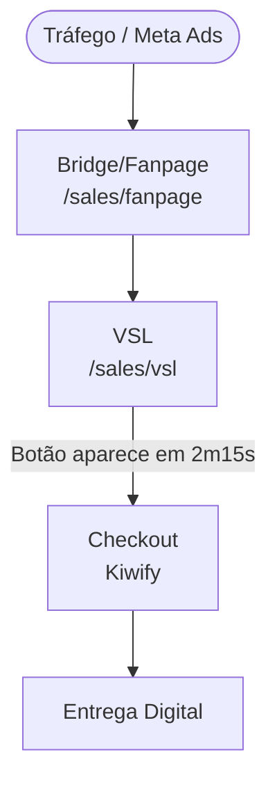

# Arquitetura do Projeto — SommersStore v2.0

Documento atualizado em 16/03/2026. Reflete a reestruturação completa para plataforma de produção digital.

---

## 1. Mapa de Projetos

```
SommersStore/                        ← Raiz do Repositório
│
├── config/                          ← Configuração central da marca
│   └── brand_config.json
│
├── knowledge/                       ← Base de conhecimento (IA + Copywriting)
│   ├── audience/                    ← Avatar do cliente
│   ├── copy_frameworks/             ← PAS, AIDA, Storytelling...
│   └── prompts/                     ← Prompts mestres dos agentes
│
├── funnels/                         ← Templates de funis reutilizáveis
│   ├── lead-magnet/
│   ├── sales-page/
│   └── upsell-flow/
│
├── platform/                        ← Infraestrutura e integrações
│   ├── agents/                      ← Agentes de IA (AIOX)
│   ├── automations/
│   ├── integrations/
│   │   ├── kiwify/
│   │   ├── firebase/
│   │   └── email/
│   └── workflows/
│
├── projects/
│   ├── loja-digital/                ← Plataforma de vendas (Next.js)
│   │   └── app/sales/
│   │       ├── v3/light/            ← Sais de Banho (Ativo)
│   │       ├── vsl/                 ← VSL / Vídeo de Vendas (Ativo)
│   │       ├── fanpage/             ← Bridge Page (Ativo)
│   │       ├── velas/               ← (Futuro)
│   │       └── como-plantar/        ← (Futuro)
│   │
│   ├── electro-store/               ← Loja Electro (Next.js + MedusaJS)
│   │   └── storefront/
│   │
│   └── _template/                   ← (Futuro) Template para novos produtos
│
├── docs/
│   └── project_map.md               ← [ESTE ARQUIVO]
│
├── .aiox-core/                      ← Orquestrador de Agentes (AIOX)
├── firebase.json                    ← Deploy Firebase (aponta para loja-digital)
└── .firebaserc                      ← Projeto Firebase: sommersstore-c6c23
```

---

## 2. Fluxo de Venda Ativo (Sais de Banho)



---

## 3. Servidores de Desenvolvimento

| Porta | Projeto | Comando |
|---|---|---|
| 3001 | `loja-digital` (Sais de Banho) | `cd projects/loja-digital && npm run dev` |
| 3000 | `electro-store` | `cd projects/electro-store/storefront && npm run dev` |

---

## 4. Integrações Ativas

| Serviço | Uso |
|---|---|
| **Firebase** | Hosting, Backup e Infra Exclusiva (`sommersstore-c6c23`) |
| **GitHub** | Repositório central (`SommersStore/SommersStore.git`) |
| **Kiwify** | Checkout e entrega de infoprodutos |
